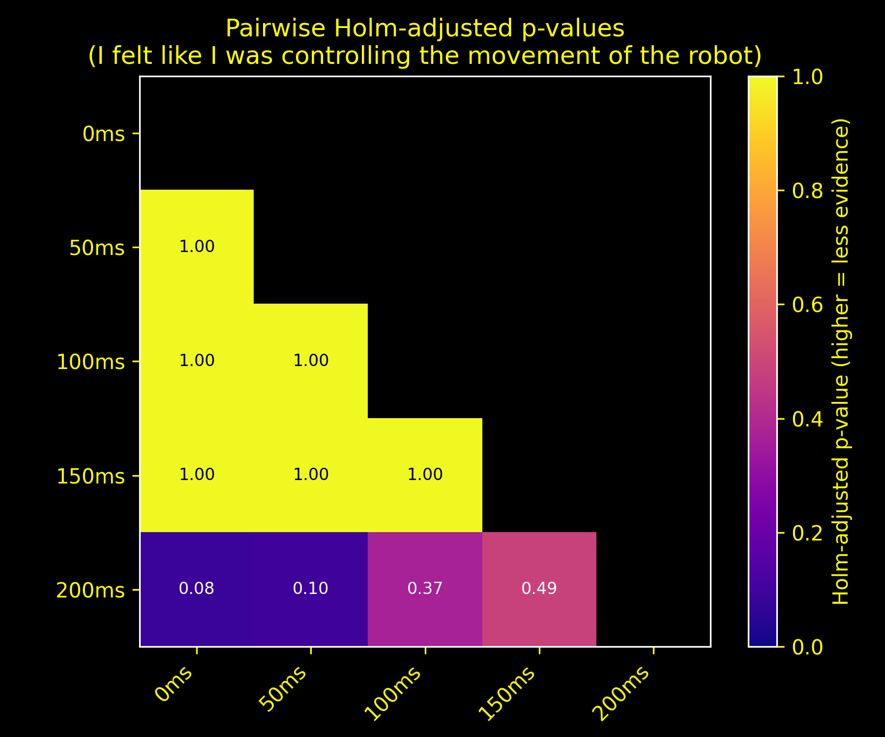
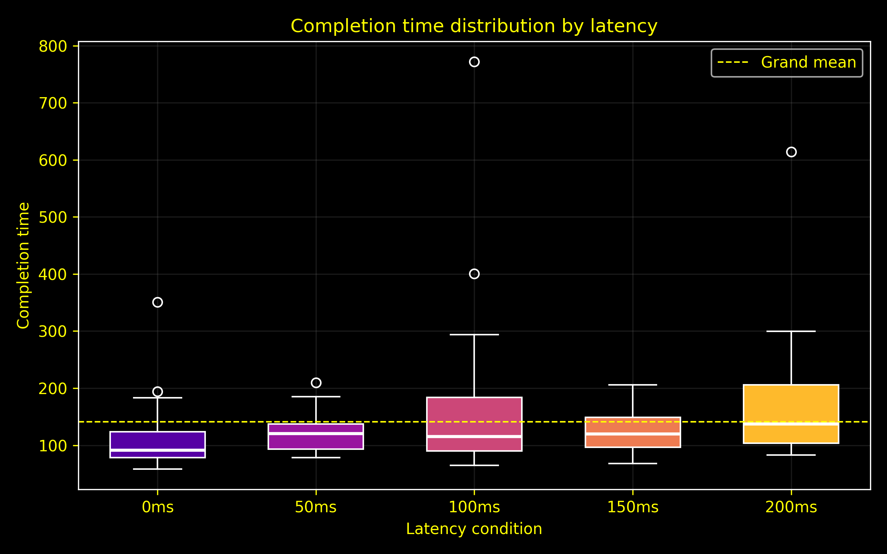
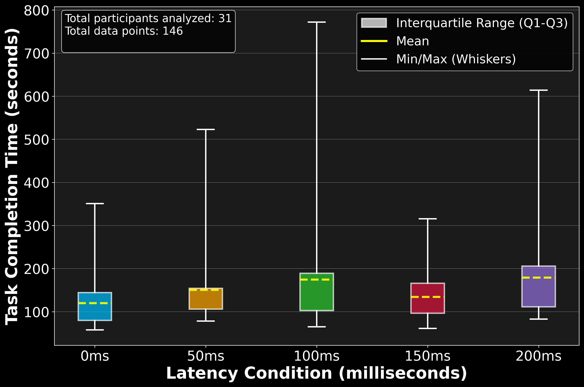

# Quantitative Performance Analysis

## What does this repository contain?

This repository contains three projects:

1. Analysis of Variance on latency perception when using robotic hands.
2. Analysis og Operator Coverage in 4g and 5g networks during stationary and movement, comparing accross many network metrics.
3. Efficiency analysis of 3D pathfinding algorithms for drones. 

## Examples of results

QPA entails performing statistical analysis on results to gauge whether results are explained by chance or effect.

